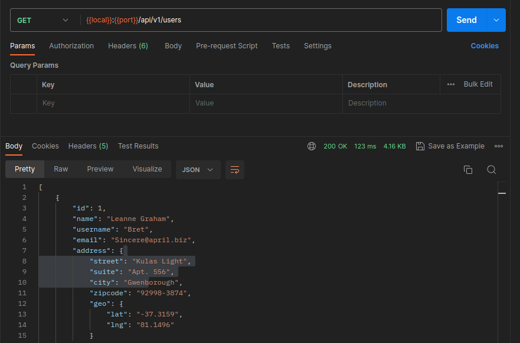
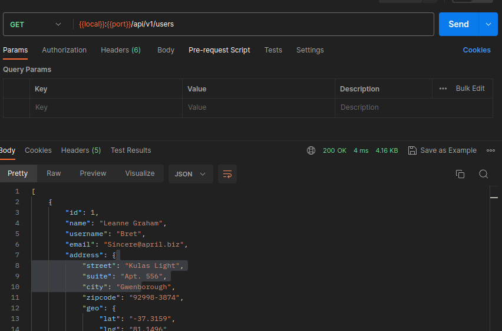

# Guava Cache Implementation

Welcome to the Guava Cache Implementation repository! Here, you'll find an implementation of the Guava cache dependency, enabling you to harness the power of caching in your projects. This repository showcases a simple project that leverages various technologies, including:

- Spring Web for web development.
- Guava Cache for efficient caching.
- WebClient for implementing REST API communication.
- JUnit and Mockito for comprehensive testing.

Feel free to explore the code and make the most of the caching mechanism to enhance the performance and efficiency of your applications.

Here is an example of the response before Caching is implemented:

Then the response after Caching is implemented: (Notice the difference in the response time)

